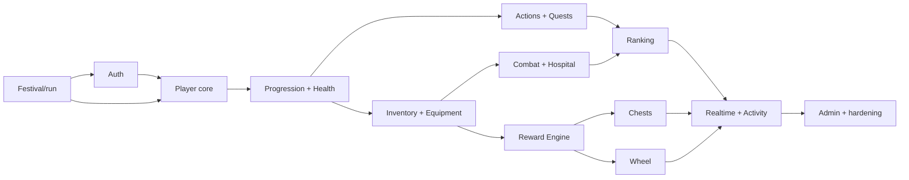

# Domain boundaries and dependencies

Shared primitives are one-way dependencies: festival clock/day key, active-run/eligibility guard, integer rounding, XP/HP processors, coin ledger, item grant and supply reservation, secure weighted roll, idempotency, activity event, outbox notification.

| Domain | Owns / commands | Depends on | Realtime / transaction |
|---|---|---|---|
| Authentication | accounts, invites, sessions; redeem/revoke | clock, audit | session changes / yes |
| Festival Configuration | fixed config, active run, pause intervals; reset/pause/end | auth/admin | run/phase / yes |
| Players | identity/character and run state | run, progression, health | state / yes |
| Progression | XP, level rewards | player, reward engine | XP/level / yes |
| Health | HP mutations, midnight heal | player, equipment, Hospital | HP / yes |
| Hospital | stays, discharge, Hospital equipment | health, inventory | status/timer / yes |
| Actions | definitions, submissions, usage/cooldown | eligibility, progression, health, quests | pool/state / yes |
| Action Validation | validator eligibility and acceptance orchestration | Actions, player | pool / yes |
| Daily Quests | day progress/completion | accepted Action events, rewards | progress / yes |
| Inventory | owned stacks/items | reward engine, run | inventory / yes |
| Equipment | equipped slots/effects/supply | inventory, clock | equipment / yes |
| Consumables | item-use orchestration | inventory, target domain | inventory/state / yes |
| Combat | Chaos snapshots, locks, Mirror/Thorns/Phoenix | inventory, equipment, health | lock/HP / yes |
| Economy | coin ledger/balance projection | player | coins / yes |
| Reward Engine | rolls/grants/overflow/supply reservation | economy, inventory | via callers / yes |
| Chests | openings, credits, immutable rewards/reveal | reward engine, economy | result/inventory / yes |
| Daily Wheel | entitlement/spins/results/reveal | reward engine, combat | result/state / yes |
| Ranking | total-XP/death ordering projection/freeze | progression, run | ranking / read projection |
| Activity History | append-only public-safe events | all command domains | activity / joins caller tx |
| Notifications | outbox and persistent notices | activity/events | yes / outbox tx |
| Admin | audited orchestration/corrections | all through public commands | run/corrections / yes |
| Assets | manifest/typed mappings | definitions | no / build-time |

Domains never directly write another domain's tables except through a shared transactional service/function. Notifications and ranking never control gameplay.

After foundations, pure definitions/UI shells can proceed in parallel, but transaction implementation follows the graph. Actions/Quests and inventory/equipment may overlap after H2; Chest and Wheel presentation may overlap only after Reward Engine contracts stabilize.
